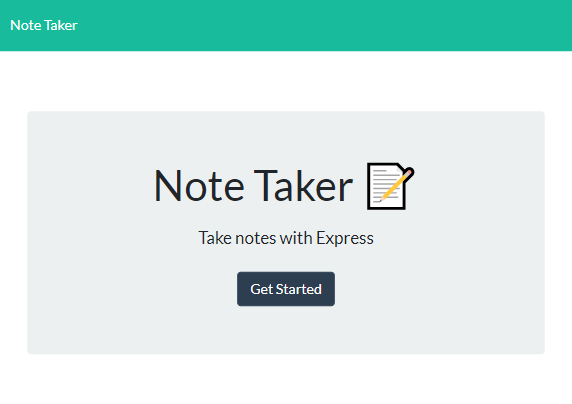
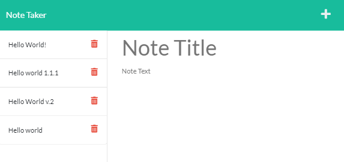

# Note Taker  
  
## Table of Contents

- [Description](#description)

- [Installation](#installation)
  
- [Usage](#usage)
  
- [Credits](#credits)

- [License](#license)

- [Questions](#questions)

## Description

The purpose of this project is to allow a user to have access to a note taking website that runs off of a server. The code that I wrote was specifically the back end of this website. While this assignment was not very time consuming, it did offer a few challenges. Luckily however, the challenges I faced with this were not ones that were impossible to figure out.

## Installation
  
To install this project, you can either clone the repository or download the zip file.
  
## Usage
  
To use this project, simply go to the website at the following URL: [https://lit-citadel-42630.herokuapp.com/](https://lit-citadel-42630.herokuapp.com/). If you would like to run it locally, you can download it. You then will open an integrated terminal in the root of the project, and run npm install. You can then run npm start and go to the following URL: [http://localhost:3001](http://localhost:3001).

The website should start you out at a screen that looks like the following:

From there, you can click the button that says "Get Started".

That Should bring you to a screen where you can make new notes and look at past/sample notes:

From there, you can press the plus sign in the top right hand corner of the screen to make new notes
  
## Credits

For this project, I used the express.js and the shortid node packages. If you would like to use these packages, their links are as follows:
- Express.js: [https://www.npmjs.com/package/express](https://www.npmjs.com/package/express)
- Shortid: [https://www.npmjs.com/package/shortid](https://www.npmjs.com/package/shortid)

## License

This project is current operating under the following license:

    Unlicensed

You can find more information regarding this license by clicking on the following link:

[https://choosealicense.com/licenses/unlicense/](https://choosealicense.com/licenses/unlicense/)
    
Or by navigating to the LICENSE file in this project.

## Questions

If you have any questions, you can reach me, Thomas Ciszek, at my Email:

[tciszek515@gmail.com](#tciszek515@gmail.com)

Or at my github account:

[https://github.com/ThomasCsk](https://github.com/ThomasCsk)
